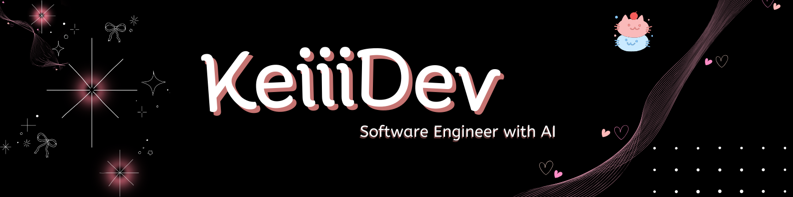

# ☁️💗 Maryorie Nieves  
### Ingeniera de Software  

🌸 Código con ternura, lógica con poder  
📍 Perú  
🩷 Desarrollo Web • Apps • Backend • Bases de Datos  

---

## 🎀 Sobre mí

Soy egresada de la carrera de **Ingeniería de Software** y me apasiona crear soluciones tecnológicas completas,  
desde interfaces bonitas hasta sistemas fuertes por dentro 💡

Me gusta trabajar tanto frontend como backend y explorar inteligencia artificial.

---

## 💗 Tecnologías & herramientas

### 💻 Lenguajes

### 🧁 Frameworks & Librerías

### 🛢️ Base de datos

### ☁️ Cloud & Servicios

### ⚙️ Servidores & herramientas

---

## 💞 Proyectos

### 🍗 Sistema de ventas
Sistema web/app completo con:
- React  
- Laravel / Node  
- MySQL / MariaDB  
- Gestión de pagos  
- Carritos múltiples  

### 🌙 Umbrae  
Proyecto narrativo ilustrado psicológico tipo webcómic.

---

## 🌸 En constante crecimiento

- Cloud computing  
- Inteligencia artificial  
- Arquitectura  
- Seguridad  
- UI/UX  

---

## 📊 Estadísticas

---

## 💌 Contacto

- GitHub: https://github.com/Keiiiyez

---

🩷 *"La programación no da miedo:3"*  

